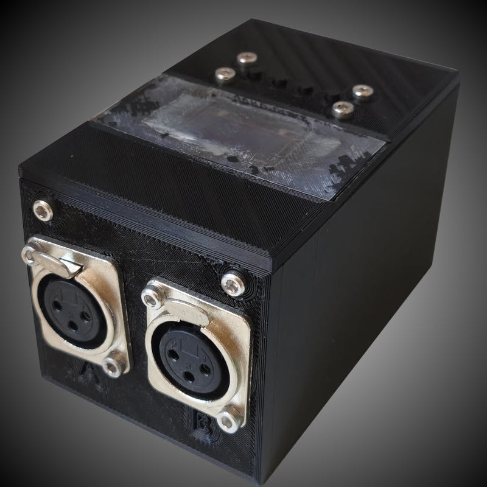
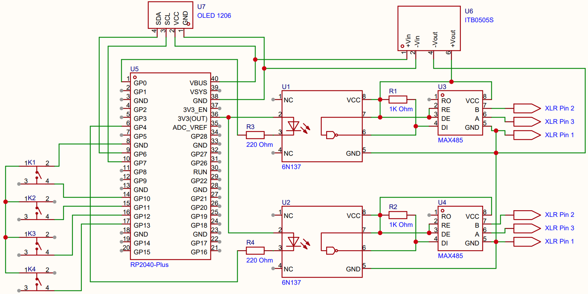
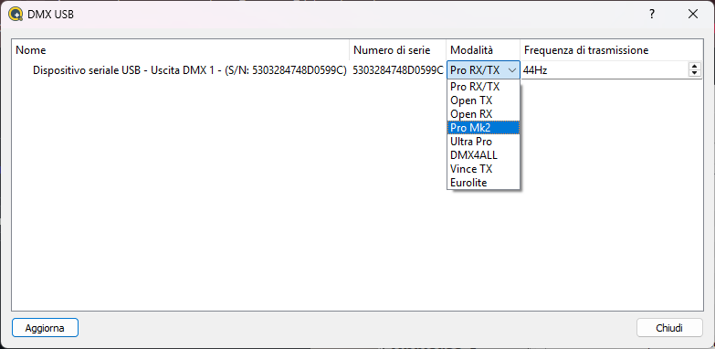
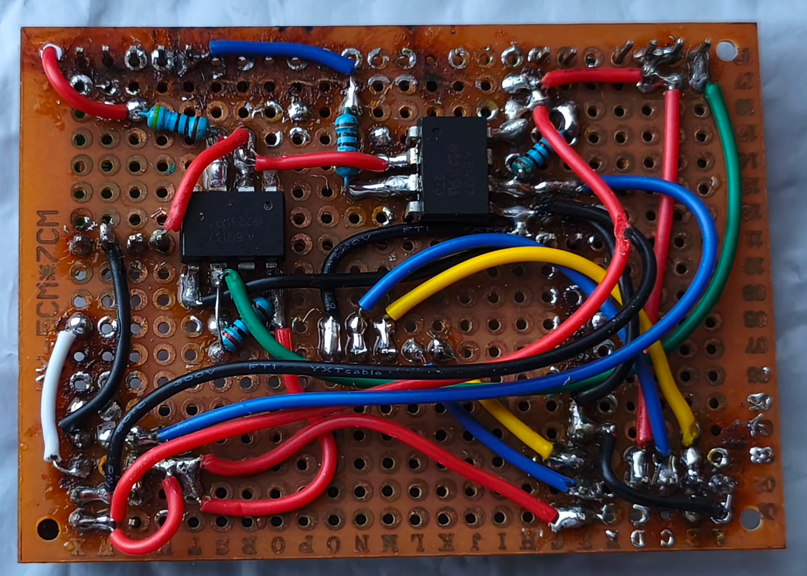
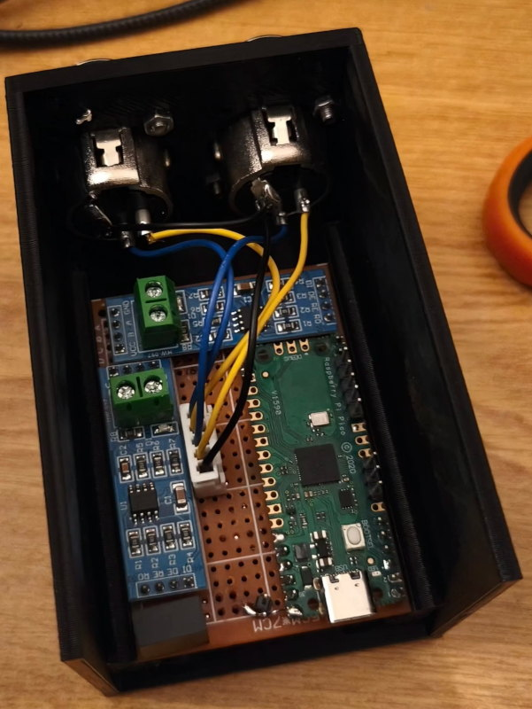

# 🎛️ DMX USB Interface — Dual Universe

### Enttec DMX USB Pro Mk2 Emulator · Built on Raspberry Pi Pico (RP2040)

 

 

*A DIY, open-source, dual-universe DMX interface with an OLED menu, standalone CUE engine, and full galvanic isolation.*

---

## 💡 Motivation

Lighting control hardware is often expensive and hard to customize. This project provides an **affordable, reliable, and highly customizable** dual-universe DMX interface using the Raspberry Pi Pico.

By emulating the industry-standard **Enttec DMX USB Pro Mk2** protocol, the interface works **out of the box** with popular lighting software like [QLC+](https://www.qlcplus.org/) — no custom drivers required.

It also features a built-in **OLED display**, **physical controls**, and a **standalone CUE engine** for managing DMX setups directly from the device.

> **Why USB instead of ArtNet?**
> My first prototype used ArtNet, but for my use cases it was far more convenient to connect via USB rather than dealing with LAN cables, IP addresses, and DHCP configuration.

---

## 📺 Demo

Menu navigation and node introduction:

*▶️ Click the image above to watch the video on YouTube*

---

## ✨ Features

| Feature | Description |
|---|---|
| 🔌 **Enttec Pro Mk2 Emulation** | Native compatibility with QLC+ and other major lighting software |
| 🎚️ **Dual Universe Output** | Two full DMX-512 universes via MAX485 transceivers |
| 🖥️ **OLED Menu System** | Integrated SSD1306 display + 4-button interface for on-device control |
| 💾 **Standalone CUE Engine** | Record and store up to 10 dual-universe CUEs to flash memory |
| 🔀 **DMX Crossfading** | Smooth transitions with configurable fade times |
| 🛣️ **Advanced Routing** | Flexible mapping of Universe 1/2 to physical Outputs A/B |
| 💿 **Persistent Settings** | All preferences saved to EEPROM |

### 🔌 Smart Disconnect Behavior

Configurable fallback modes when USB connection is lost:

- ⬛ **Blackout** — all channels go to zero
- ⏸️ **Hold Last Value** — freeze the last DMX frame
- 🎬 **Play CUE** — automatically trigger a stored CUE

---

## 🚀 How to Flash

This project uses **PlatformIO** with the Arduino framework for the Raspberry Pi Pico ([Earle Philhower core](https://github.com/earlephilhower/arduino-pico)).

### Option 1 — PlatformIO Upload *(Recommended)*

1. Install [Visual Studio Code](https://code.visualstudio.com/) and the [PlatformIO IDE extension](https://platformio.org/).
2. Open this project folder in VSCode.
3. Hold the **BOOTSEL** button on the Pico and plug it in via USB.
4. Once the Pico mounts as a mass storage device, click **Upload** (→) in the PlatformIO toolbar.

### Option 2 — Drag & Drop (UF2)

1. Build the project in PlatformIO (**Build** / ✓ icon).
2. Find the generated `firmware.uf2` in `.pio/build/pico/`.
3. Hold **BOOTSEL** and plug in the Pico — it appears as `RPI-RP2`.
4. Drag and drop `firmware.uf2` onto the drive. The Pico reboots automatically.

---

## 🧰 Hardware

The circuit implements **full galvanic isolation** between the USB controller and the DMX transceiver to protect the host computer from electrical faults, ground loops, and high-voltage transients.

An isolated DC-DC converter (**B0505S-1W**) supplies a dedicated floating 5 V rail, and two high-speed **6N137** optocouplers isolate the logic signals driving the MAX485.

### Bill of Materials

| # | Component | Link |
|:-:|---|---|
| 1 | **Raspberry Pi Pico (RP2040)** | [AliExpress](https://it.aliexpress.com/item/1005006087823796.html) |
| 2 | **MAX485 Transceiver Module** ×2 | [AliExpress](https://s.click.aliexpress.com/e/_c3NT3dPz) |
| 3 | **XLR 3-Pin Female Panel Connector** ×2 | [AliExpress](https://s.click.aliexpress.com/e/_c4q55Lx9) |
| 4 | **6N137 High-Speed Optocoupler** ×2 | [AliExpress](https://s.click.aliexpress.com/e/_c2JoN82B) |
| 5 | **B0505S-1W Isolated DC-DC Converter** | [AliExpress](https://s.click.aliexpress.com/e/_c4KkuvZv) |
| 6 | **Perfboard / PCB** | [AliExpress](https://it.aliexpress.com/item/1005006066751179.html) |
| 7 | **Tactile Push Buttons** ×4 | [AliExpress](https://it.aliexpress.com/item/1005005658595026.html) |
| 8 | **SSD1306 0.96″ OLED Display** | [AliExpress](https://s.click.aliexpress.com/e/_c4LZoMDz) |
| 9 | **Assorted Resistors** | — |
| 10 | **3D Printed Case** *(optional)* | See below |

---

### 📐 Wiring Diagram

> [!NOTE]
> This diagram was drawn after the build, so minor inaccuracies are possible — but it should be correct.

---

### 🖨️ 3D Printed Case

The enclosure is composed of 3 parts and uses **M3 screws** for assembly:

| Part | File |
|---|---|
| Case | [`Case.stl`](./3DModels/Case.stl) |
| Top Panel | [`Top Panel.stl`](./3DModels/Top%20Panel.stl) |
| USB Panel | [`USB Panel.stl`](./3DModels/USB%20Panel.stl) |

> [!IMPORTANT]
> The USB hole position must be aligned with the RP2040 on the PCB. If you use the same perfboard and place the Pico board flush against the edge, the hole should match.

---

## 🖥️ Working with QLC+

In QLC+, select **Pro Mk2** in the mode menu:

---

## ⚠️ Known Issues

- The OLED screen brightness is not sufficient in direct daylight.

---

## 📷 Build Gallery

<strong>Click to expand build photos</strong>

 

#### Back of the PCB

The two opto-isolators (6N137) with their associated pull-up resistors.

 

#### Board Inside the Case

The RP2040 on the right, MAX485 modules and B0505S on the bottom-left. Black connectors carry the OLED and button signals from the top panel.

---

## 📄 License

This project is licensed under the [Creative Commons BY-NC-SA 4.0](LICENSE.md) license.
